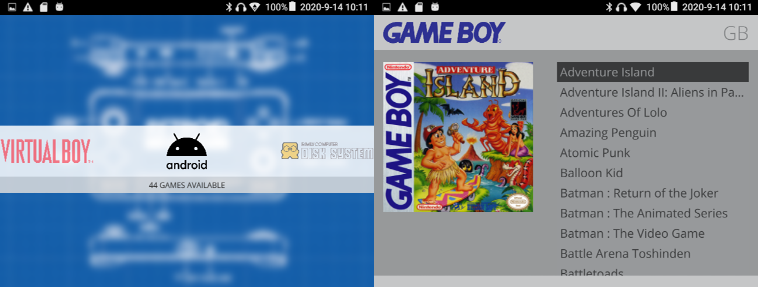

# RetroidStation

This is the port of the *Simple* theme of EmulationStation to the [Pegasus](http://pegasus-frontend.org) frontend, originally created by *Nils Bonenberger* <nilsbyte@nilsbyte.de> and ported by Mátyás Mustoha. Tweaked by me to better fit the Retroid Pocket 2 display.

## License

